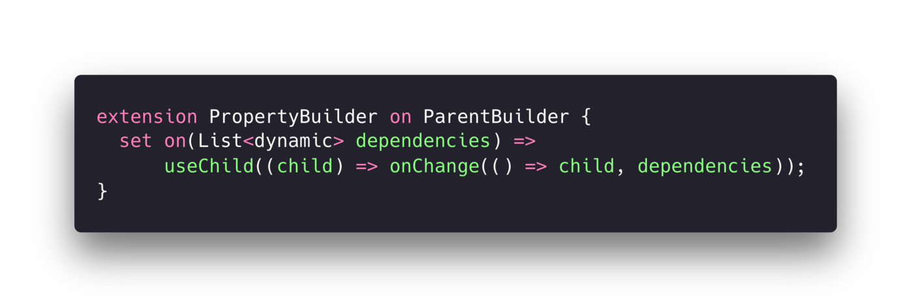

<!DOCTYPE html>
<!-- saved from url=(0032)http://127.0.0.1:51004/view/3409 -->
<html>
  <head><meta http-equiv="Content-Type" content="text/html; charset=UTF-8">
  </head>
  <body>
    

      

        <article id="content" class="markdown-body">

from: https://medium.com/@saltyaom/niku-thought-process-of-designing-a-balance-framework-1d9218fcdabd

title: Niku: Thought Process of Designing a Balance Framework

<section>

<h1 id="d4f4" class="pw-post-title ik il im bn in io ip iq ir is it iu iv iw ix iy iz ja jb jc jd je jf jg jh ji gn" data-selectable-paragraph="">Niku: Thought Process of Designing a Balance Framework</h1>
<figure class="fw fy jk jl jm jn fs ft paragraph-image">

</figure>
Since the beginning of Software development, “Developer Experience” has been discussed all the time.

Over years, they learn from their pain point, trying to solve and improve the pain point of their approach to coding.

Object-Oriented Programming, Functional Programming, Declarative Programming.

These approaches and design paradigms usually have many different benefits but all share the same goal.

It's the same reason why we move from hand-tuned assembly to high-level programming language.
<blockquote class="ks">
They make programming easier
</blockquote><h1 id="b50a" class="lc ld im bn le lf lg lh li lj lk ll lm ln lo lp lq lr ls lt lu lv lw lx ly lz gn" data-selectable-paragraph="">It’s not happening over a night</h1>
But as technology has influenced the world, we can’t afford to rewrite everything from scratch and convince the users to install a new version of the thing we wrote and its dependencies.

Take the web for an example, it has been stuck with JavaScript, a language that was written in 10 days, and it’s not quite good.

There is 2 choice we can solve the problem.
<ol class=""><li id="cd2d" class="mf mg im jw b jx jy kb kc kf mh kj mi kn mj kr mk ml mm mn gn" data-selectable-paragraph="">Convince every browser to create a new language, deprecate JavaScript, convince every developer to migrate their codebase to the new written language then convince everyone to update their browser to the new version.</li><li id="81b9" class="mf mg im jw b jx mo kb mp kf mq kj mr kn ms kr mk ml mm mn gn" data-selectable-paragraph="">Stick with JavaScript and try to improve it.</li></ol>
We choose the second one because it’s what could happen in a matter of days, And most developers would likely not going to refactor their entire codebase to this new, well-designed language if it doesn’t work with their current codebase.

That’s why we don’t see new any new language used in frontend web development (excluding Web Assembly which still requires JavaScript).

When something is created, it’s stuck with that environment although some might migrate to a better solution, it will be gradually adopted and not happen over a night.

It requires a lot of hard work and time to fully migrate from one to another.
<h1 id="999e" class="lc ld im bn le lf lg lh li lj lk ll lm ln mt lp lq lr mu lt lu lv mv lx ly lz gn" data-selectable-paragraph="">To live with what we have</h1>
Even if you’re trying to gradually migrate away from your current environment, you’ll still require to work with it, or at least edit or refactor some part.

You are stuck with that environment you’re working in, that’s when the library, and framework can help you.

These tools are like a programming language, it helps you solve one thing and another while benefiting you with something but mostly trying to improve your developer experience.

Browsers used to have their own way to control the web and differs from each other, resulting in one code to works in some and not working in others.

However, in 2006, a library name “jQuery” was released. It’s a library that helps developers use the same code to work on every major browser and not only that, it makes coding easier removing boilerplates, and handling redundant things so developers could develop web easier.

Later, many concepts from jQuery were migrated to browser API itself, and thus union all the browser API to be the same. But it takes a very long time until then.

At the time, you couldn’t wait for the others to make API work across browsers, you have to live with what you had.

That’s why jQuery was created.
<h1 id="3f55" class="lc ld im bn le lf lg lh li lj lk ll lm ln mt lp lq lr mu lt lu lv mv lx ly lz gn" data-selectable-paragraph="">Same problem, different approaches</h1><figure class="mx my mz na ge jn fs ft paragraph-image">

<figcaption class="nb bm fu fs ft nc nd bn b bo bp co" data-selectable-paragraph="">Millennium Gamepad</figcaption></figure>
Do you know a gamepad? It’s a good tool for us to enjoy our games.

There were many tools back then you could play a game, like Nintendo Power Glove, NES Duck Hunt, even keyboard and mouse.

But do recognize that those different designs all share a simple goal?
<blockquote class="ks">
How could we make our player have fun playing game.
</blockquote>
After the years, the gamepad survives and becomes the primary control of the console game.

It survives not because it’s as good as Duck Hunt when you’re playing a shooting game, or as looks cool as Nintendo Power Glove.

But because it has a great design decision. Universal, and easy to use, and people like it.

In web development, there are many popular frameworks trying to make web development easier.

But we didn’t pick this framework because it has many stars on Github or has many questions on Stackoverflow.

We adopt a library and framework not because it offers, that’s only an effect. But because of the design decisions made creating these frameworks.

If the design decision was right, no matter what features you will need, you will eventually get it somehow.

Evan You, the creator of Vuejs once said at JSConf Asia.
<blockquote class="ks">
What you should probably care more about is about internal technical decision, what actually defers these framework.
</blockquote><h1 id="42af" class="lc ld im bn le lf lg lh li lj lk ll lm ln lo lp lq lr ls lt lu lv lw lx ly lz gn" data-selectable-paragraph="">People don’t know what they really want</h1>
If you are walking down the street, try randomly asking someone what they’re missing from their life and how could they make it better.

They don’t know.

Many people don’t know they want a smartphone before Steve Jobs introduced an iPhone.

To answer this question, Steve Jobs tried to ask people the same problem above, what they’re missing from their life, but no one really knows what they’re missing.

Steve carefully observe the pattern and found that people carry a lot of things to go to work and he combined all of that into a single product.

That design decision is what makes an iPhone a great product at the time.

But do you know that before an iPhone was created, there was almost a similar device named “Newton”.

To put it briefly, it’s like an iPhone but uses a stylus as a primary input method.

Well, it failed. That’s why Steve Jobs said at the introduction of an iPhone that “nobody wants a stylus”.

Although, it is quite similar to the iPhone the reason that it fails isn’t that it has a stylus but rather its design decision.

It doesn’t solve any problems as an iPhone does. Well the “nobody wants a stylus” is a part of it.
<h1 id="d651" class="lc ld im bn le lf lg lh li lj lk ll lm ln mt lp lq lr mu lt lu lv mv lx ly lz gn" data-selectable-paragraph="">Declarative Complexity</h1>
Declarative programming sounds good.

It’s like instead of telling how to go from your home to the mall by saying the taxi driver left or right every corner, you tell the taxi driver to just go to the mall, and that’s it.

In programming, it isn’t easy to create a framework to be declarative. It requires thoughtful decisions on every corner, because
<blockquote class="ks">
“Anything that can go wrong will go wrong.”
</blockquote>
Even a simple library but making it declarative is hard.

Especially when you’re creating a declarative programming language Framework for creating a Cross-Platform app is hard.

That’s what Flutter is doing. It has to handle every edge case.

You can build UI in Flutter declaratively.

But because it has to be declarative, Flutter has to handle every edge case instead of developers, and because of possibility in programming is infinite, even creating UI with a design system is still complex.

Because of its complexity, developers have to handle that possibility. That’s why Flutter is verbose.

Declarative library and framework usually go into the pitfall of what I call <strong class="jw in">“Declarative Complexity”, </strong>which makes the codes too verbose and makes imperative programming somehow has better Developer Experience than Declarative.

It’s controversial for Declarative Programming to have worse “Developer Experience” than imperative programming, it defeats its purpose of becoming declarative in the first place.

But how verbose is too verbose?

Take this code as an example and tell me it’s doing:
<figure class="mx my mz na ge jn fs ft paragraph-image">

</figure>
As you might have guessed, it creates a text with a red background when the width is less than 568px or it’ll be blue.

Criteria for each person are different but for me, when I have to think about what the code is doing, I considered it’s too verbose.

This is one common component that you will most likely have in your codebase, creating an app with Flutter.

And well, I’m certainly not happy to write this code over and over again.

So I’ll try to find a way to make it better.
<h1 id="ce9d" class="lc ld im bn le lf lg lh li lj lk ll lm ln mt lp lq lr mu lt lu lv mv lx ly lz gn" data-selectable-paragraph="">Imperative of Declarative</h1><figure class="mx my mz na ge jn fs ft paragraph-image">

<figcaption class="nb bm fu fs ft nc nd bn b bo bp co" data-selectable-paragraph="">Hina, cute and funny</figcaption></figure>
But have can we improve this code?

I think about it for quite a long time, even seeking out how other framework and language is doing but I found something quite interesting.
<ul class=""><li id="900d" class="mf mg im jw b jx jy kb kc kf mh kj mi kn mj kr nr ml mm mn gn" data-selectable-paragraph="">React Native offers you to separate structure declaration from styling by using StyleSheet.</li><li id="9bc3" class="mf mg im jw b jx mo kb mp kf mq kj mr kn ms kr nr ml mm mn gn" data-selectable-paragraph="">SwiftUI offers you a way to style components by using modifier property (chaining method)</li></ul>
These two are the complete opposite of what Flutter is trying to do.

1In Flutter, everything is a widget, you use Widget to build a UI. Well, when everything is a Widget, that means a UI representative like a Text, Button, Dropdown is also constructed as the same as what you can’t see like ValueListener, GestureDetector, FutureBuilder.

It doesn't decouple the UI representation from Business Logic, instead, the Flutter approach tied it together and merge it together making it more verbose than separable logic, making it too nested than it should be.

2Abstraction in Flutter is hard. You see, Flutter and Dart are Object-Oriented Programmings which means Abstraction, Inheritance is one of its main strengths, you should be able to create an abstraction over a class easily.

However, creating an abstraction of an old widget is not quite as traditional as OOP.

Take <strong class="jw in">“TextFormField”</strong> as an example.

TextFormField is a class that extends “TextField” which when constructed, will directly “UnmanagedRestorationScope” which also store “TextField” and drop all of its property accepted by the constructor.

This means, when you construct a TextFormField, you are unable to get its property back or at least a very hard thing to do in not a test environment.

This will be a problem when you don’t know what the widget is holding but require its property to create a new one based on its value. Presumably, usually occurs when you’re using a library and want to change its behavior.

You just can’t fully create an abstraction, inherits or polymorphism over the widget, or can but is limited.

From the problems above, I draft a requirement of a way of writing Flutter for my happiness for myself.
<ol class=""><li id="ed0e" class="mf mg im jw b jx jy kb kc kf mh kj mi kn mj kr mk ml mm mn gn" data-selectable-paragraph="">It should be recognizable at the first glance</li><li id="c530" class="mf mg im jw b jx mo kb mp kf mq kj mr kn ms kr mk ml mm mn gn" data-selectable-paragraph="">It shouldn’t be too nested.</li><li id="eb3b" class="mf mg im jw b jx mo kb mp kf mq kj mr kn ms kr mk ml mm mn gn" data-selectable-paragraph="">It should handle redundant and remove boilerplate code</li><li id="03bb" class="mf mg im jw b jx mo kb mp kf mq kj mr kn ms kr mk ml mm mn gn" data-selectable-paragraph="">Easy to create abstraction.</li></ol>
But how?
<h1 id="1d24" class="lc ld im bn le lf lg lh li lj lk ll lm ln mt lp lq lr mu lt lu lv mv lx ly lz gn" data-selectable-paragraph="">Developer-Centered Design</h1>
Do you know “User-Centered Design”? TLDR; It’s designed which revolved around user first.

I really like the idea of the concept, so I just adapt the idea into improving the Developer Experience.

I have a job title as “Platform Architect” at work, it’s a fancy word for handling architecture for developers not limited to Infrastructure but rather the codebase itself.

In fact, I work as a Frontend Platform Architect, which mainly helps developers with an architect of Monorepo Frontend and improves the developer experience.

I investigate a way to improve DX, code quality, maintainability, investigate and design an approach for developers, or wrote an internal library to resolve redundant task if I have to.

Most of the tasks I accomplish are because I care about how developers approach a problem and how to handle them, it takes one to know one and to prevent them in the first place.

To resolve the problem correctly you have to clearly understand what problem they are facing correctly.

I usually use the User-Centered Design approach but instead design code and approach for developers.

Back to Flutter.

When you’re creating let's say, a Text. You should be able to focus on a Text, not its parent.

Background, padding, border-radius is considered as property on many UI library and framework. So let’s make it a property, so you can focus mainly on Text.

You can think of this thing as props instead of a Widget.
<figure class="mx my mz na ge jn fs ft paragraph-image">

</figure>
Now at the first glance, I know that this code creates a Text. At least it’s easier to read than that nested syntax.

But with this, it has a little problem.
<blockquote class="ks">
What if I have to multiple layer of background color?
</blockquote>
This will not work with the current syntax, because the code doesn’t know which one to put a layer on.

And seconds, Flutter’s property is usually nested even on the inside, looks at <strong class="jw in"><em class="od">“textStyle” </em></strong>property<em class="od">. </em>It takes another argument to handle styling, this is good for separating the styling type as a group and making it reusable in any other widget which also needs text styling.

However, since it accepts an object, you have to declare an object first and sometimes you will need abstraction over an object to create a shortcut.
<blockquote class="oe of og">
But what shortcut?
</blockquote>
In Flutter, an object property can hold many values, take Padding for example.

It mainly holds 4 values, padding of the 4 sides as a number.

When you declare that you want all 4 sides to be the same value you use:
<pre class="mx my mz na ge ok bt ol">padding: EdgeInsets.all(20)</pre>
When you want top-bottom and left-right to be the same, you can use:
<pre class="mx my mz na ge ok bt ol">padding: EdgeInsets.symmetric(   horizontal: 24,   vertical: 12, )</pre>
But notice that no matter what you do, the declaration of <code class="gm or os ot on b">EdgeInsets</code> is always required, even if we know that it’s padding.

SwiftUI solve this at the language itself auto infer property of the type that it accepts, which mean if this same syntax is implemented in SwiftUI it would be like
<pre class="mx my mz na ge ok bt ol">.padding(.horizontal, 24) .padding(.vertical, 12)</pre>
However, Dart doesn’t have this feature, so you have to declare EdgeInsets every time you pass it to padding.

But what if we create a shorthand property to accept a just numbers and map itself to EdgeInsets?
<figure class="mx my mz na ge jn fs ft paragraph-image">

</figure>
It’s much shorter and simple, the shorthand property <code class="gm or os ot on b">px, py</code> handles the task of creating EdgeInsets for us, so you don’t have to explicitly create one.

The name <code class="gm or os ot on b">px</code> , <code class="gm or os ot on b">py</code> is borrow from <code class="gm or os ot on b">TailwindCSS</code> naming convention, so if you’re a web developer you might be familiar with it.

But now the question is still remains, how can I handle multiple layers of background Color and Padding?

The answer and the approach is the one I have already shown you just a moment ago.

Instead of providing it as a prop, let’s make it a <em class="od">chainable property</em> so we can tell which one comes first or last, better yet, we can provide a priority of overriding a value if needed.
<figure class="mx my mz na ge jn fs ft paragraph-image">

</figure>
Now I can handle the layering and priority of the styling. The property will be as a Queue Stack.

But what if I want to accept the parameter as an object of itself?

The good thing is, with these shorthand properties declared manually, I could name it as whatever I want or even shorten it down.
<figure class="mx my mz na ge jn fs ft paragraph-image">

</figure>
Great, now I can do the same with property inside, I just have to create a class that inherits… oh you can’t directly do that in Dart if I happen to abstract over a widget like TextFormField.

So I’ll just create a class that accepts the parameters like Text and returns the instance of Text instead. With this, I could declare any property I want to store easily.

Accepting some property as props starting to doesn’t make sense when shorthand property trying to achieve the same goal.

Let’s say I declare padding of all sides to 20 but then I want padding-top to be 40, how can I know which one to override which one?
<figure class="mx my mz na ge jn fs ft paragraph-image">

</figure>
The answer is with parameters like this, you can’t assign priority property over one another.

So how?
<h1 id="68b3" class="lc ld im bn le lf lg lh li lj lk ll lm ln mt lp lq lr mu lt lu lv mv lx ly lz gn" data-selectable-paragraph="">Chain of priority</h1>
So, why do you think SwiftUI uses changing the property to handle declaration for one that could be overridden?

Why would CSS override property over one another?

It’s the order of the property that gives it a priority to partly override the previous value.

We can do the same thing in Dart with chain property like what we did with Padding and BackgroundColor.
<figure class="mx my mz na ge jn fs ft paragraph-image">

</figure>
With this, the property can entirely or partly rewrite itself based on the order of its call.

And to make sure that we don’t accidentally switch over to the parent stack, we could separate with a property that return the parent instance instead.
<figure class="mx my mz na ge jn fs ft paragraph-image">

</figure>
To make parent property accessible on every component, we can separate a parent builder to a different builder class then make a builder class that requires the parent builder to extends the class
<figure class="mx my mz na ge jn fs ft paragraph-image">

</figure>
With this, we don't have to hold the parent property and rewrite the parent property for every builder class we might need.

With this concept, I wrote a library called Niku and create multiple building blocks for composing Flutter Widget.

But for now, let just looks at how could I write a Flutter Widget using Niku.
<figure class="mx my mz na ge jn fs ft paragraph-image">

</figure>
You see that the code is really easy to understand at first glance. It does solve the 4 principles I have for writing UI in Flutter.

However, this is not the end of the story, but rather a valuable lesson I learn from it.
<h1 id="1933" class="lc ld im bn le lf lg lh li lj lk ll lm ln mt lp lq lr mu lt lu lv mv lx ly lz gn" data-selectable-paragraph="">The Side Effect Naive Abstraction</h1><figure class="mx my mz na ge jn fs ft paragraph-image">

<figcaption class="nb bm fu fs ft nc nd bn b bo bp co" data-selectable-paragraph="">Hifumi</figcaption></figure>
Although Niku does really solve the problem of developing Widget in Flutter for developers. However, for a maintainer like me, the code is quite hard to maintain as a developer.

Since the way how I created Builder Widget, isn’t a true abstraction which means I have to declare <strong class="jw in">every possible properties </strong>of each builder widget including shorthand properties and even setter properties.

For a small Widget like Text, I could create in less than 1,000 lines of code (including documentation) however things start to get complexes like the factory method of Button and adaptive property of switch and sliders can easily exceed 2,000–3,000 lines of code.

Not only that but the complex Widget like TextFormField which has over 200 properties including shorthand exceeds over 7,800 lines of code for a single widget.

Maintaining such a large amount of code can easily be prone to errors, luckily many developers who use Niku does helps submit Pull Requests fixing what I have been making mistake in.

Not only with the problem of maintainability, but invoking 7,800 lines of code in a single Widget construction is not quite healthy for performance.

Although Flutter did really well creating Niku Widget and can handle 60fps. But for me, 7,800 loc is still too big to comprehend, so there’s a bit of performance tradeoff when using heavy animation.

And another problem is that without declaring widget property <code class="gm or os ot on b">final</code> you can’t declare the widget as a constant, which is a widget that won’t get rebuilt if the state changed.

Now to list the problems, there are:
<ol class=""><li id="2902" class="mf mg im jw b jx jy kb kc kf mh kj mi kn mj kr mk ml mm mn gn" data-selectable-paragraph="">Too many lines of code to maintain, how can I decouple some parts of code to be reused on other classes</li><li id="d5e8" class="mf mg im jw b jx mo kb mp kf mq kj mr kn ms kr mk ml mm mn gn" data-selectable-paragraph="">Does it really require a custom setter to set the properties?</li><li id="d84d" class="mf mg im jw b jx mo kb mp kf mq kj mr kn ms kr mk ml mm mn gn" data-selectable-paragraph="">Is it possible to reuse properties across classes?</li></ol>
With all these problems, I couldn’t happily maintain the project unless I find a way to fix them.

So I do read and research more about what could possibly go wrong and how could I implement it better for quite a long time.
<h1 id="43b8" class="lc ld im bn le lf lg lh li lj lk ll lm ln mt lp lq lr mu lt lu lv mv lx ly lz gn" data-selectable-paragraph="">The Microservice of Object-Oriented</h1><figure class="mx my mz na ge jn fs ft paragraph-image">

</figure>
After a long search, I even read more concept about Object-Oriented even if I dislike it because many programming languages makes it looks too verbose (looking at you Java) and carefully read a list of Dart language feature that I could take benefits from.

Even though I dislike Dart because it’s mixed with Java and JavaScript but has verbose from the Java side, I find two features that really important for refactoring Niku.

It’s named is extension and mixins. Basically, <strong class="jw in">Dependency Injection</strong> in Dart.

The extension allows you to define the class method without touching the main class. You can create any method from the class and polymorph it if needed.

The real magic is with <strong class="jw in">Mixins </strong>which is a direct <strong class="jw in">Dependency Injection. </strong>Which you could also inject custom properties.

Now, why <strong class="jw in">Dependency Injection </strong>is important?

Because it allows you to decouple duplicated parts of classes into external code and then reuse any classes.

This is different from inheritance because you could inject as many dependencies as you need and you can choose to not override it. You can imagine it as a blueprint.
<figure class="mx my mz na ge jn fs ft paragraph-image">

<figcaption class="nb bm fu fs ft nc nd bn b bo bp co" data-selectable-paragraph="">Mixins example</figcaption></figure>
Notice that I don’t declare any property in MyWidget class, but I could still somehow use the method and get the property?

With this, I could decouple a large number of properties into separate mixins.

Imagine `TextStyle` as an example, it roughly requires 300–400 lines of code to implement one in a widget, now I could take out that 300–400 lines of code out of every widget that uses TextStyle.

The interesting thing is that, remember the ParentBuilder? With mixins, I don’t need to declare and override a build method anymore, I could just store a widget as a getter then let the build function get the build widget then just return it.

But now I have a bit of a question.
<blockquote class="oe of og">
Object or Mixins?
</blockquote>
Now that you see I can decouple both primitive type and non-primitive type like Object but should I really store Object as a Mixin?

You see, mixins are great for class abstraction but when you pass the object to the constructor, if you use the mixin, you have to flatten to properties in the constructor first before assigning them directly to a class property.

Doing that defeats the purpose of mixins in the first place.
<blockquote class="ks">
To decouple and reuse piece of code
</blockquote>
If I use mixins to store complex Objects like TextStyle, then I will have to flatten them on every widget, even if I can create a helper method to help flatten it but that’s quite unnecessary compared to passing custom Object representation which stores the property and shortens property instead.
<h1 id="b5f3" class="lc ld im bn le lf lg lh li lj lk ll lm ln mt lp lq lr mu lt lu lv mv lx ly lz gn" data-selectable-paragraph="">Custom or Native Setter</h1>
Well, you see, previously on my first publish of Niku.

I define a custom setter to parse a value before setting it to shorthand property.

But that requires me to set up a custom setter for each and every property.

As much I dislike Dart, there’s one specific feature I really like a lot. Its name is “Cascade Notation”

Basically, it allows you to set multiple properties at the same time, and we could use that in our code.
<figure class="mx my mz na ge jn fs ft paragraph-image">

</figure>
This code allows us to set the value of color, font size, and font-weight at the same time without writing any setter.

Because you could set the property of class by default.

With this Cascade Notation, I can finally drop setter to be able to chain property entirely for primitive types, and for non-primitive, since we’re using Custom Object to handle nested properties, we could also drop any nested properties setter in Widget.

If we need a shorthand property setter we could just define a custom setter instead and decouple it to mixin so it could be reused on every class.

Now with empty parameter mixins, I could use a little bit of a hack.

You see, Dart getter cloud return void, and since getter is just an ordinary function, I could just declare a shortcut to assign properties to whatever I want without the need to pass parameters.
<figure class="mx my mz na ge jn fs ft paragraph-image">

</figure>
Now there’s a little bit of a problem.

In Dart, you couldn’t use cascade notation inside a cascade notation which means setting another class with cascade notation while setting another with the same method won’t work.
<figure class="mx my mz na ge jn fs ft paragraph-image">

</figure>
Now working with this technical detail, we could prevent this by wrapping a parenthesis to explicitly declare which part to use cascade notation or…
<h1 id="269f" class="lc ld im bn le lf lg lh li lj lk ll lm ln mt lp lq lr mu lt lu lv mv lx ly lz gn" data-selectable-paragraph="">Reference Bridge</h1><figure class="mx my mz na ge jn fs ft paragraph-image">

</figure>
Let’s break from this problem for now with a new question.

If I’m using cascade notation, what would happen if I want to add a custom widget that Niku doesn’t offer? Would I break from ParentBuilder and wrap a custom Widget then rewrap it with ParentBuilder again?

Pause, take a moment to think about it.
<figure class="mx my mz na ge jn fs ft paragraph-image">

</figure>
No, I won’t allow breaking, that defeats the purpose of ParentBuilder in the first place if I have to do that, but then how?

Do you know how React Hook work?

It’s actually a function of getter, setter, notifier, and working together.
<figure class="mx my mz na ge jn fs ft paragraph-image">

</figure>
See counter, what do you think it is?

Yes, the counter is actually a function that returns an inner value of the getter, the reason why it returns the value in Function Component is that React invokes the function call for you.

Every time the setter function is called, it updates the internal value then notify that React should re-render the component, then counter get the internal value as a reference return it has a value for you.

That’s also the reason why you can’t use hooks outside React component, because it require React environment to handle the getter for you.

We could use the same ideology from React and apply it to Niku here.
<figure class="mx my mz na ge jn fs ft paragraph-image">

</figure>
Setter in ParentBuilder is a bit special, it doesn’t actually store any property except a widget.

Every time setter is called, it creates a widget then overrides property <code class="gm or os ot on b">widget</code> and adds previous property as a child of itself.

This means ParentBuilder doesn’t actually store a stack of properties or widgets, but just a single widget itself, dropping unnecessary memory to allocate multiple widget trees.

When the function <code class="gm or os ot on b">useParent</code> is called, it takes a callback function which then passes the current reference of Widget itself then replaces the widget with the new instance of widget from the callback.

This could also apply to the complex object mechanism in <code class="gm or os ot on b">Text</code> the widget we discussed before.
<figure class="mx my mz na ge jn fs ft paragraph-image">

</figure>
Not only that it can style complex objects, but it can also pass any value between builder and a value of class instance itself.

Just like a bridge.
<h1 id="c152" class="lc ld im bn le lf lg lh li lj lk ll lm ln mt lp lq lr mu lt lu lv mv lx ly lz gn" data-selectable-paragraph="">Code Separation</h1>
The style builder works great, we could clearly see what we’re doing, which part we styling, and reducing boilerplate code.

But how could we make it better?

Well, many frameworks encourage you to separate the structure and styling apart from each other and make it easy to reuse, eg. HTML&amp;CSS, React Native, Vuejs, Svelte.

Doing that, we could clearly see which part are we making the progress on, hence we could apply to style to any widget we want.

But how could we do it?

Remember that with our builder class store all of the properties required to create a widget we want?

Since we are holding the primitive value of it makes it null when we don’t actually set any.

We could easily reconcile any null property and set the value of the instance class we want.
<figure class="mx my mz na ge jn fs ft paragraph-image">

</figure>
You can predefined Style somewhere like a StyleSheet then apply the style and let the reconciliation process just pick a non-null value and assign it to the current class. This is somewhat equivalent to CSS class styling.

These styles applying to the reconciliation process is passed as a reference, so memory allocation is only needed once declaring a style.

It’s possible that you could just separate your entire styling using <code class="gm or os ot on b">apply</code> styling.

And because it's a programming language, accepting parameters like CSS-in-JS is easy, since it is just a collection of functions you return widget from.
<figure class="mx my mz na ge jn fs ft paragraph-image">

</figure>
Or even deriving a styling from another style is also possible. Just make sure you take derivation as a value instead of a reference to prevent accidentally setting an original value.
<figure class="mx my mz na ge jn fs ft paragraph-image">

</figure>
With this, it opens the possibility to create an entire library CSS library like Bootstrap, Bulma, Tailwind CSS in Flutter. You predefined a class then apply the style just like you would with CSS.
<h1 id="b6c7" class="lc ld im bn le lf lg lh li lj lk ll lm ln mt lp lq lr mu lt lu lv mv lx ly lz gn" data-selectable-paragraph="">Repaint Allocation</h1>
To handle constant 60fps on mobile devices, the app has to be efficient enough.

Niku is uncontactable because non of its field is final, but we can fix the problem by just letting it re-render every state change.

To prevent unnecessary repaint, Niku can cache the dependencies need for updating the UI of the widget and prevent it from being re-render.
<figure class="mx my mz na ge jn fs ft paragraph-image">

</figure>
This <code class="gm or os ot on b">.on</code> property, specified which value needs to be updated to perform a repaint.

Which basically check the dependencies every time it needs to be repainted and if the value is different, means that it should be repainted. The code could easily simplified as below:
<figure class="mx my mz na ge jn fs ft paragraph-image">

</figure>
The <code class="gm or os ot on b">.on</code> property is assigned to the extension of the ParentBuilder widget.
<figure class="mx my mz na ge jn fs ft paragraph-image">

</figure>
But this means that the <code class="gm or os ot on b">OnChange</code>is going to be invoked every time the state change and allocate some memory, but it will not be re-rendered.

You can use the actual <code class="gm or os ot on b">OnChange</code> widget to prevent memory allocation, since the widget accepts the callback function which will be executed if repaint need, and that’s even it’s going allocate memory, but doing that will lose some Developer Experience of property builder, so the question is, should you?
<h1 id="ac68" class="lc ld im bn le lf lg lh li lj lk ll lm ln mt lp lq lr mu lt lu lv mv lx ly lz gn" data-selectable-paragraph="">Balancing Performance and Developer Experience</h1><figure class="mx my mz na ge jn fs ft paragraph-image">

</figure>
But why we would create all these solutions to just improve the developer experience? Why not just stick to native Flutter?

Then I have a question to ask you.

Why do we invent programming language when hand-tuned assembly turns out to have a better performance.

Why do we invent Python and don’t just use C++ for everything because it’s clear that C++ is just so faster than Python?

Why do we create GUI in the first place when the terminal is clearly used lesser resources.

Why do you use Flutter in the first place? When native mobile is clearly faster?

All of these have a reason, and clearly, performance is not the only thing that matters.
<blockquote class="oe of og">
Premature Optimization Is the Root of All Evil
</blockquote>
It’s fine to lower down performance by a bit but greatly increase developer experience and productivity.

Flutter is already fast and always has been. Besides devices, these days could easily handle some more memory allocation and iteration and still be able to achieve 60fps easily.

Wrapping <code class="gm or os ot on b">ChangeOn</code> on everything is fine on the surface, but the <code class="gm or os ot on b">ChangeOn</code> itself also allocate some memory and sacrifice some readability, most of the time the extension <code class="gm or os ot on b">.on</code> is just enough.

You should use <code class="gm or os ot on b">ChangeOn</code> on heavy tasks like intense animation re-rendering on 120fps devices, that’s a great case where you want to sacrifice some readability for performance.

So back to the question to while use Niku or even create Niku in the first place?

I didn’t create Niku to increase the performance of the Flutter app, if it actually does then that’s the side effect of it.

I create Niku because as much as I love optimization and cursing most apps are created with Electron which has a million-dollar company as a back, I believe Developer Experience is also an important factor to consider.
<figure class="mx my mz na ge jn fs ft paragraph-image">

<figcaption class="nb bm fu fs ft nc nd bn b bo bp co" data-selectable-paragraph="">Which one are you going to use</figcaption></figure>
So matter how great an app performance is if nobody wants to develop that app anymore then it wouldn’t be anything to develop and nobody is going to use it anymore.
<h1 id="a6ec" class="lc ld im bn le lf lg lh li lj lk ll lm ln mt lp lq lr mu lt lu lv mv lx ly lz gn" data-selectable-paragraph="">Afterword</h1><figure class="mx my mz na ge jn fs ft paragraph-image">

</figure>
This article/blog explains the thought process and design decision while creating a Flutter library for composing UI named, “Niku”.

I didn’t write this article to promote the library, Niku 2, or the thought process of the article hasn’t had a stable release yet, I find the thought process behind it interesting and valuable, so it would be great to share.

The thought behind creating a balanced framework especially in a declarative environment that has a lot of edge cases is hard and most likely going to fail at some point, but you can use the mistake you made to improve yourself.

And at some point where you feel like achieving something, you could always share it with someone and help them get better from your experience and mistake.

The concept of this article has been used internally, but still in progress of work as Niku 2 on Github as an Opensource on the branch <code class="gm or os ot on b">exp/heaven-and-earth</code> , in case you want to check it out.

<a href="https://github.com/saltyaom/niku/tree/exp/heaven-and-earth" rel="noopener  ugc nofollow" target="_blank">

<h2 class="bn in do bp pr ps pt pu pv pw px il gn">GitHub - SaltyAom/niku at exp/heaven-and-earth</h2>
<h3 class="bn b do bp pr ps pt pu pv pw px co">Effortless property builder for composing maintainable Flutter UI Creating UI in Flutter is easy. Its declarative…</h3>

github.com

</a>

Note that by the time of article release, it doesn’t have any documentation yet.

Also, the image used in this article is from a game called, <a class="au qg" href="https://bluearchive.jp/" rel="noopener ugc nofollow" target="_blank">“Blue Archive”</a>, every image is used from the <a class="au qg" href="https://youtu.be/Chh_rhWqvAA" rel="noopener ugc nofollow" target="_blank">2nd PV of the game</a>, in case you might want to check it out. I’m actually planning on cosplaying some characters from there too.

Happy coding~ \( ﾟヮﾟ)/

</section>
        </article>
      

    

</body></html>

